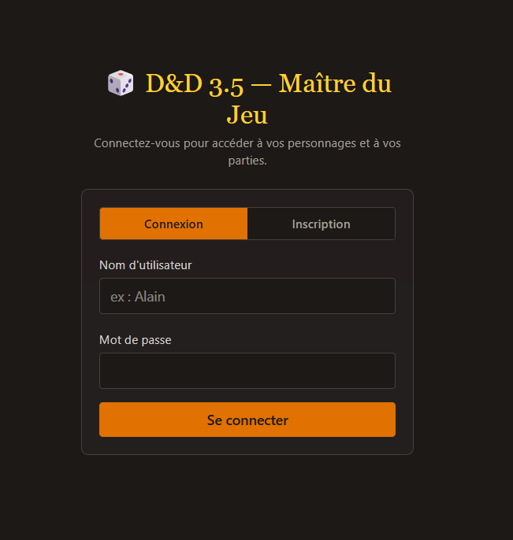
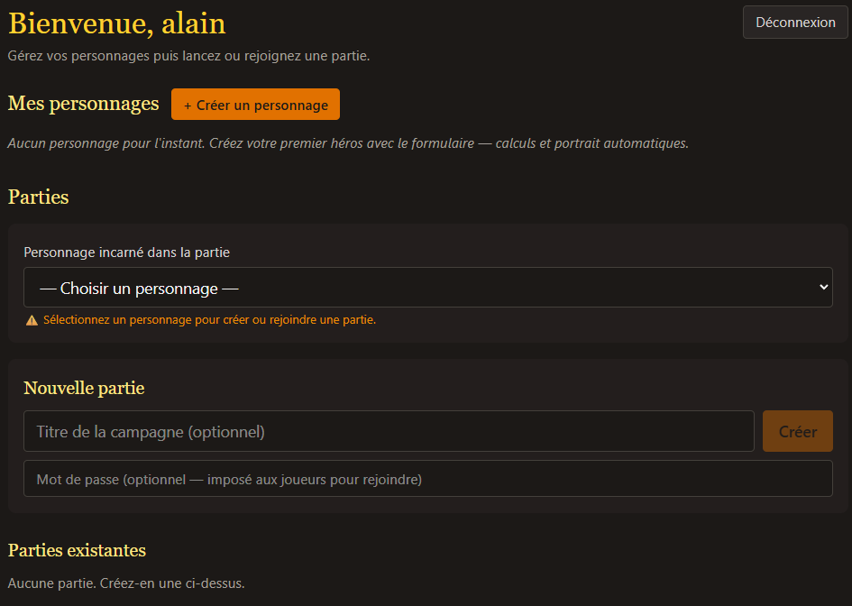
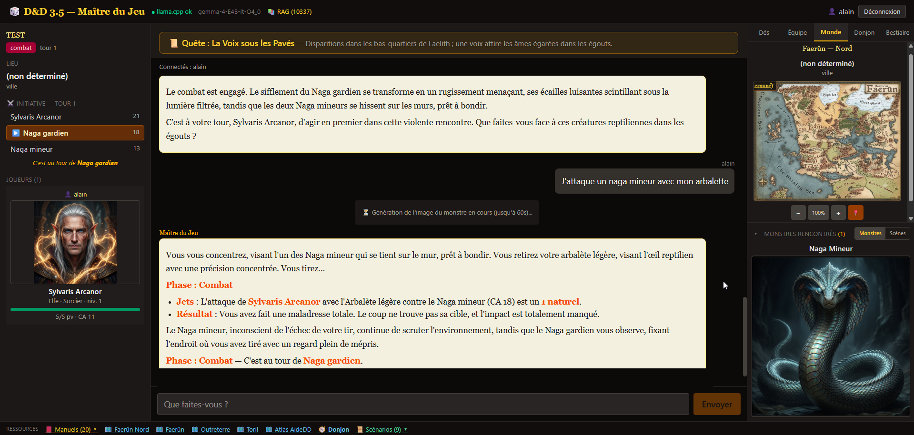
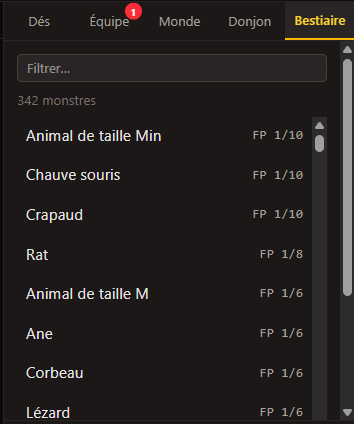

# 🐉 Maître du Jeu IA — Donjons & Dragons 3.5

###PROJET EN COURS DE DÉVELOPPEMENT###

Application web **multijoueur autonome** qui joue le rôle de **Maître du Jeu (MJ)** pour une
table de Donjons & Dragons 3.5 : un LLM local (Gemma, via Ollama ou llama.cpp) narre
l'aventure, arbitre les règles avec de **vrais jets de dés**, gère les combats tour par tour,
et **génère les images** des monstres rencontrés et des portraits de personnages via ComfyUI.

Aucun service externe ni compte requis : tout tourne en local (Docker), les joueurs se
connectent depuis leur navigateur sur le réseau local.

| | |
|---|---|
| **Backend** | FastAPI + WebSocket, ~40 tools Python (function-calling) |
| **Frontend** | React 18 + TypeScript + Vite + Tailwind |
| **LLM** | Ollama / llama.cpp (OpenAI-compatible) — Gemma 4 par défaut |
| **Règles** | RAG ChromaDB sur les manuels 3.5 (ingestion locale) |
| **Images** | ComfyUI (monstres, portraits PJ, cartes de donjon) |

## ✨ Fonctionnalités

### Table multijoueur temps réel
- **Salon de jeu en ligne** : création/rejoindre une partie, optionnellement protégée par mot
  de passe ; chat partagé avec narration du MJ en streaming token par token.
- **Fiches de personnages complètes** : création guidée (caractéristiques, race, classe,
  compétences plafonnées selon INT/niveau, dons limités selon niveau) puis consultation et
  modification à tout moment — PV, conditions, sorts, équipement.
- **Jets de dés réels** : attaque, dégâts, sauvegardes, initiative… toujours résolus par des
  tools Python (jamais « simulés » par le LLM).

### Exploration & combat
- **Combat tour par tour** suivi mécaniquement : ordre d'initiative, PV des monstres,
  auto-avance quand un joueur passe son tour, clôture automatique quand tous les monstres
  sont à terre.
- **Carte du monde interactive** (Côte des Épées / Faerûn) et **donjon procédural** rendu en
  SVG : pièces explorées, portes, déplacements suivis par le MJ.
- **Bestiaire intégré** (~65 monstres) consultable, avec fiche détaillée et image générée.

### IA générative (ComfyUI)
- **Images de monstres générées automatiquement** dès leur apparition dans la narration
  (cache par description : l'image ne change pas tant que la fiche ne change pas).
- **Portraits de personnages** générés à la création.
- **Illustrations de scènes et lieux** à la demande.

### Base de connaissances (RAG)
- Les manuels D&D 3.5 (dépôt local `knowledge_import/`, textes OCR fournis par vos soins)
  sont vectorisés dans ChromaDB ; chaque message joueur injecte les extraits de règles
  pertinents dans le contexte du MJ → réponses fidèles aux règles (modificateurs de carac,
  sauvegardes, états flat-footed…).
- Ingestion incrémentale : `docker compose exec dnd35 python -m server.rag --ingest`.

## 📸 Captures d'écran

| | |
|---|---|
|   | |
|  |  |
|  |  |
|  |  |
|  |  |
|  |  |
|  |  |

## 🚀 Démarrage rapide (Docker)

Prérequis : Docker Desktop, [Ollama](https://ollama.com) (ou llama.cpp) avec un modèle de chat,
et idéalement [ComfyUI](http://comfyui.com) pour les images.

```bash
# 1. Config : copier l'exemple puis ajuster (backend LLM, modèle, ports)
cp config/config.example.yaml config/config.yaml     # Windows: copy

# 2. Corpus RAG (optionnel) : déposer vos textes OCR dans knowledge_import/
#    puis peupler la base :
docker compose exec dnd35 python -m server.rag --ingest

# 3. Démarrer (arrière-plan, redémarrage automatique)
docker compose up -d --build        # → http://localhost:8123

# Arrêt / journaux
docker compose down
docker compose logs -f dnd35
```

Port modifiable : `set DND35_PORT=9000` (ou `.env`). Accès hors réseau local : redirection de
port sur votre box ou reverse proxy HTTPS devant le port 8123.

### Sans Docker

```bash
py -m pip install -r requirements.txt
cd client && npm install && npm run build && cd ..   # frontend → server/static/
py -m uvicorn server.main:app --port 8000            # → http://127.0.0.1:8000
```

## ⚙️ Configuration (`config/config.yaml`)

| Clé | Défaut | Rôle |
|---|---|---|
| `llm.backend` | `llamacpp` | `llamacpp` ou `ollama` (endpoint OpenAI-compatible) |
| `llm.base_url` | `http://localhost:8080/v1` | Endpoint du backend LLM |
| `llm.model` | `gemma-4-E4B-it-Q4_0` | Modèle de chat (Qwen, Mistral… supportés) |
| `llm.tool_mode` | `auto` | `native` / `prompt` (balises `<tool>`) / `auto` |
| `llm.detect_simulation` | `true` | Corrige les « simulations » textuelles d'outils |
| `rag.enabled` | `true` | Knowledge base ChromaDB (règles D&D 3.5) |
| `rag.source_dir` | `./knowledge_import` | Corpus `.txt/.md` à ingérer |
| `rag.embedding_model` | `embeddinggemma` | Modèle d'embeddings dédié (llama.cpp CPU) |
| `paths.data_dir` | `./server/data` | Parties, fiches, caches d'images, ChromaDB |

Variables d'environnement : `DND35_CONFIG` (chemin config), `COMFYUI_BASE_URL`
(`http://host.docker.internal:8188` par défaut).

## 🧠 Comment ça marche

1. Le joueur écrit dans le chat → WebSocket `/ws/{partie_id}`.
2. Le **PromptBuilder** assemble le system prompt : instructions MJ + état de partie
   (phase, combat, quête) + sections dynamiques + extraits RAG.
3. L'**Orchestrator** boucle function-calling : le LLM choisit parmi ~40 tools Python
   (`lancer_attaque`, `engager_combat`, `perso_creer`, `carte_deplacer`,
   `monstre_consulter`, …) filtrés par phase de jeu.
4. Chaque tool touche l'état persistant JSON (partie, fiches, bestiaire) ; les patches
   résultants sont broadcastés à tous les clients (PV mis à jour en direct, etc.).
5. La narration finale est streamée à toute la table ; les hooks post-tour génèrent
   les images manquantes et font avancer les tours automatiquement.

## 📁 Structure

```
├── client/                 ← React (pages accueil/partie/création perso)
├── server/
│   ├── main.py             ← FastAPI + WebSocket + routes REST
│   ├── config.py           ← chargement config/config.yaml
│   ├── llm/                ← client LLM, orchestrator (boucle tools), prompt_builder
│   ├── game/               ← PartyState (JSON persistant), sessions WS
│   ├── tools/              ← dés, état, fiches, monstres, cartes, manuels, scénarios
│   ├── rag/                ← chunker, embeddings, ChromaDB store, CLI ingestion
│   ├── image/              ← workflows ComfyUI + helpers génération
│   └── prompts/            ← SystemPrompt MJ + sections dynamiques par phase
├── cartes/                 ← cartes de référence servies aux joueurs
├── config/                 ← config.example.yaml (+ config.yaml gitignored)
├── knowledge_import/       ← corpus RAG local (gitignored, apportez vos textes)
└── screenshots/            ← captures pour ce README
```

## 🔒 Note juridique

Ce projet est un **outil de table** non officiel. Il ne distribue aucun contenu protégé :
déposez vous-même vos textes de règles dans `knowledge_import/` et vos PDF dans
`server/data/manuels/`. Donjons & Dragons est une marque de Wizards of the Coast.
