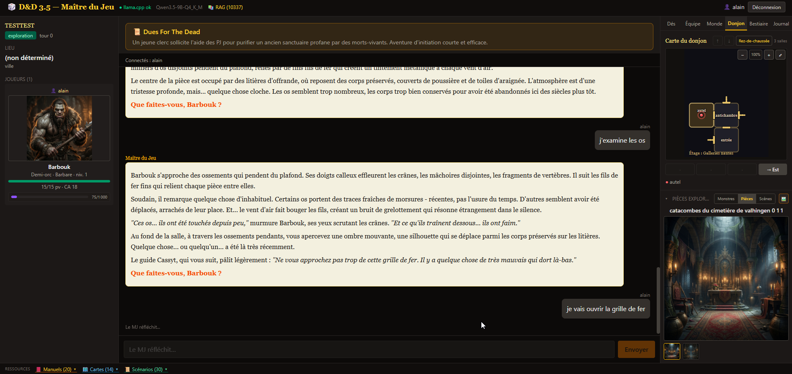
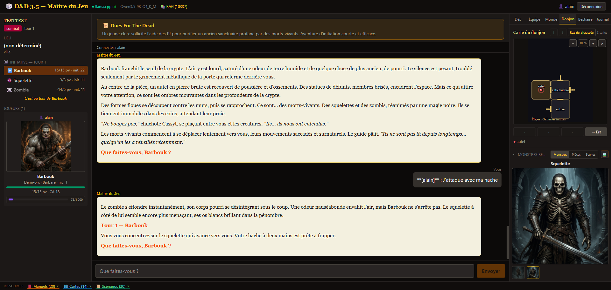
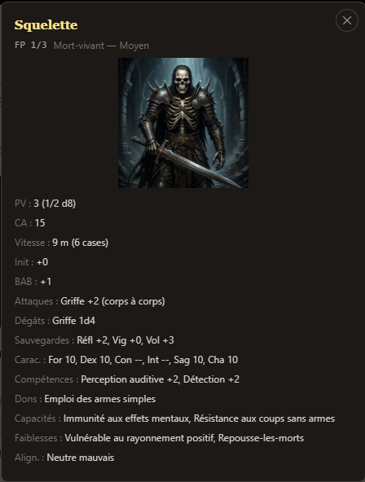
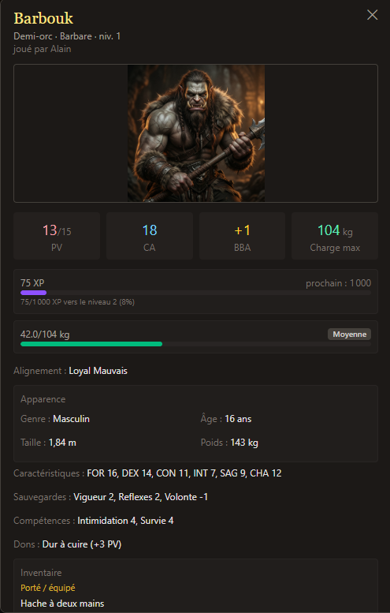

# 🐉 Maître du Jeu IA — Donjons & Dragons 3.5

### PROJET EN COURS DE DÉVELOPPEMENT ###

Application web **multijoueur autonome** qui joue le rôle de **Maître du Jeu (MJ)** pour une
table de Donjons & Dragons 3.5 : un LLM local (Gemma 4 ou Qwen 3.5, via **llama.cpp** par
défaut ou Ollama) narre l'aventure, mais **la mécanique est décidée par le serveur** —
vrais jets de dés via des tools Python, **combat tour par tour conforme aux règles 3.5**
(initiative, monstres, mourants, coups de grâce, XP DMG officielle), **carte de donjon
synchronisée avec la narration**, mémoire de campagne persistante et génération d'images
(monstres, portraits, scènes) via ComfyUI.

Aucun service externe ni compte requis : tout tourne en local (Docker), les joueurs se
connectent depuis leur navigateur sur le réseau local.

| | |
|---|---|
| **Backend** | FastAPI + WebSocket, **76 tools Python** (function-calling) |
| **Frontend** | React 18 + TypeScript + Vite 6 + Tailwind 4 |
| **LLM** | llama.cpp (par défaut) / Ollama (OpenAI-compatible) — Gemma 4, Qwen 3.5… |
| **Règles** | Moteur de combat serveur + XP/niveaux 3.5 officiels (DMG) ; sorts, repos, voyage SRD |
| **Qualité** | **745 tests pytest** (moteur de combat, carte, fiches, scénarios, trésors, robustesse bêta, E2E sans LLM) |
| **Images** | ComfyUI (monstres, portraits, salles, scènes) — optionnel |
| **Données** | Inventaire & encombrement (poids PHB 3.5, or compris), mémoire de campagne persistante |

## 📸 Captures d'écran

| | |
|---|---|
|  |  |
| *Salon de jeu : chat du MJ, carte du donjon en direct, galerie des pièces illustrées.* | *Combat : ordre d'initiative, tour actif par joueur, galerie des monstres rencontrés.* |
|  |  |
| *Fiche de monstre 3.5 complète (bestiaire officiel) avec portrait généré.* | *Fiche de PJ : PV, CA, BBA, charge transportée, XP, apparence, inventaire.* |

## ✨ Fonctionnalités

### Table multijoueur temps réel
- **Salon de jeu en ligne** : création/rejoindre une partie, optionnellement protégée par mot
  de passe ; chat partagé avec narration du MJ (en bloc ou token par token, configurable).
- **Multi-comptes garanti** : chaque joueur se connecte avec son compte (token vérifié au
  `join` WebSocket — l'identité déclarée ne fait pas foi) et ne peut incarner que **ses**
  personnages ; la garde de tour compare le **personnage incarné par la connexion** au
  personnage actif — deux PJ du même compte (deux onglets) ne se volent pas leurs tours,
  et l'action hors-tour d'un autre compte est **refusée** (jamais réattribuée).
- **Diffusion temps réel fiable** : messages joueurs, jets de dés informatifs (canal dédié
  **sans tour LLM**), narrations du MJ, patches d'état (PV, XP, initiative…) et roster —
  tout est diffusé à toutes les connexions, sans doublon chez l'expéditeur.
- **Suppression de compte** (auto-service, confirmation) : parties créées, fiches et
  portraits supprimés, tokens invalidés — les tables d'autrui ne sont pas touchées.
- **Fiches de personnages complètes** : création guidée (caractéristiques, race, classe,
  compétences plafonnées selon INT/niveau, dons limités selon niveau) puis consultation et
  modification à tout moment — PV, conditions, sorts, équipement. L'or porté (départ −
  achats) pèse : 50 pièces = 1 livre (PHB).
- **Apparence par race** : tirage officiel de l'âge (selon le groupe de classe), de la taille
  et du poids (selon le sexe) aux tables du PHB, alimentant le portrait.
- **Jets de dés réels** : attaque, dégâts, sauvegardes, initiative… toujours résolus par des
  tools Python. Un « jet simulé » par le LLM est **détecté et corrigé** automatiquement.

### Combat tour par tour (décidé par le serveur, narré par le LLM)
- **Initiative officielle respectée dès le round 1** : si un monstre gagne l'initiative, le
  serveur joue son tour **avant** l'action déclarée par le joueur ; le joueur ne peut agir
  que lorsque c'est son tour (garde de tour par joueur).
- **Rotation 100 % serveur** : attaques automatiques des monstres et alliés invoqués (fiche
  du bestiaire), passes des combattants incapables, **stabilisation officielle des mourants**
  (1d20/round), **coups de grâce** sur cible à terre, clôture automatique (victoire/défaite).
- **XP et niveaux officiels (DMG 3.5)** : chaque PJ vivant gagne l'XP de la table
  « Experience Point Awards » pour chaque ennemi vaincu, selon son propre niveau ; montées
  de niveau (jet de dé de vie) et pertes de niveau (energy drain) automatiques.
- **Rattrapages serveur** : un combat narré en prose sans `engager_combat`, des dégâts jetés
  mais non appliqués, une invoquation oubliée, un sort de soin sans tool… sont détectés et
  régularisés mécaniquement — la narration ne peut plus créer de fiction sans effet.
- **Suppression de partie par le propriétaire uniquement** : `meta.createur` posé à la
  création, contrôle serveur sur la suppression (403 pour un compte étranger).
- **Barres de progression visibles** : XP (niveau actuel → suivant) et **charge transportée**
  (poids kg / charge max, or compris) sur les cartes PJ en jeu, les fiches et l'accueil.

### Robustesse — « le serveur décide, le LLM narre »
- **Mécanique d'abord, prose ensuite** : les jets (tours de monstres, XP,
  clôtures) sont résolus par le moteur serveur, puis narrés par un appel LLM
  dédié **sans outils** (résultats imposés) — jamais l'inverse ; repli bloc
  brut si l'appel échoue.
- **Rattrapage des déplacements** : « je vais au nord » narré en prose sans
  `carte_donjon_explorer` est rejoué avec un correctif — l'outil arbitre
  (refus si pas de porte), la carte ne reste plus figée ni désynchronisée.
- **Anti-répétition intelligente** : une narration qui recopie un tour
  précédent est relancée ; les re-descriptions de salles à description figée
  restent légitimes (exception dédiée).
- **Bornes anti-blocage** : chaque appel LLM (300 s), chaque stream (90 s sans
  token, 300 s au total) et chaque envoi WS (5 s) est borné — un tour ne peut
  plus rester figé indéfiniment, même derrière un backend LLM partagé ou en
  rechargement.
- **WS résilient** : heartbeat ping/pong avec reconnexion automatique, re-join
  transparent (parties protégées comprises), historique remplacé au `joined`
  (fin des doublons), indicateur de réflexion levé au retour.
- **Conformité 3.5 garantie** : PV bornés au maximum, rattrapage des soins
  narrés sans tool, XP répercutée sur la fiche ET l'état de partie, fiches
  par compte utilisateur (comparaison insensible à la casse, renommage suivi
  par le fichier, rattachement des fiches orphelines).
- **Assainissement de la narration finale** : coulisses LLM (« Vérifions son
  état réel »), templates cassés (« Touché ! () »), timeouts inventés et
  paraphrases doublées sont purgés avant diffusion ; les valeurs de PV
  narrées (« chutent à 10/11 ») sont réécrites sur l'état serveur.
- **Magie contrainte de bout en bout** : un sort narré ou **déclaré** par le
  joueur sans `incanter_sort` est re-validé par le serveur (préparation,
  emplacements, liste de classe) — appliqué si les règles le permettent,
  **refusé honnêtement** à la table sinon ; la mémorisation demandée
  (« je mémorise X et Y ») est appliquée avec fusion des préparations.
- **XP de secours** : si le suivi `monstres_combat` est perdu avant la
  clôture, le snapshot `monstres_derniers` paie l'XP de la victoire — une
  victoire n'est jamais « sans XP ».
- **Galerie d'images réactive** : une nouvelle image (monstre, pièce, scène)
  active automatiquement son onglet dans la colonne droite.

### Exploration & carte du donjon (synchronisation garantie)
- **Carte du donjon procédurale rendue en SVG** : salles explorées, portes, étages
  (rez-de-chaussée → sous-sols), position du groupe en direct.
- **Plans de donjons fidèles aux scénarios** : un fichier `*.donjon.json` à côté du
  PDF d'un module décrit le plan canonique (salles, positions, portes, descriptions,
  ennemis, trésors, pièges, PNJ, étages nommés). `carte_donjon_entrer` charge ce plan
  au lieu du procédural — la carte se révèle toujours salle par salle, mais sa
  disposition et son contenu collent au scénario (ex. *Dues for the Dead* inclus).
  Brouillons automatiques pour les autres modules :
  `py scripts/generer_donjon_scenario.py --scenario <id>` (détection des créatures du
  module dans le texte FR/EN, disposition déterministe connexe, à affiner à la main).
- **La carte est injectée dans le prompt du MJ** (salle courante, portes réellement
  ouvertes, descriptions figées des salles) : la narration ne peut plus inventer une porte
  ou une salle absente — `carte_donjon_explorer` refuse toute direction sans porte en
  listant les portes existantes.
- **Descriptions canoniques figées** par salle (protégées contre la réinvention) : en
  revenant sur ses pas, le groupe retrouve la salle **à l'identique** (décor + état des
  lieux : monstres vaincus, coffres vidés…), y compris après sortie/retour du donjon.
- **Trésor canonique crédité mécaniquement** : les trésors rédigés à la main des salles
  de scénario (« gemmes et pièces pour 200 po au total », « une bourse de 15 po »,
  « 75 pc ») sont **crédités au PJ qui fouille** par le serveur — plus besoin que le MJ
  écrive « +200 po » lui-même. Prix unitaire reconnu (« 10 po pièce » = pas un total),
  un seul crédit par salle (marqueur persistant), bornes anti-fiction, et
  **anti-double-crédit** quand le MJ a déjà chiffré le gain.
- **Voyage hors donjon** conforme au SRD : durée réelle (vitesse, terrain, marche forcée),
  rencontres aléatoires, risque de s'égarer et météo.
- **Carte du monde interactive** (Côte des Épées / Faerûn) : position du groupe par ville
  repère.

### Campagne, scénarios & magie
- **Choix du scénario depuis l'interface** (catalogue : Laelith, Royaumes Oubliés…) ; une
  **bible de scénario** (résumé, PNJ, ennemis, étapes) est réinjectée à chaque tour pour
  garder le MJ sur la trame — réinterprétée en règles 3.5 même si le module source est 5e.
- **Mémoire de campagne persistante** : missions, lieux, PNJ, monstres combattus (remplie
  automatiquement à chaque victoire) et position du groupe — réinjectée dans le prompt du MJ
  pour une cohérence longue durée.
- **Magie D&D 3.5** : incantation validée (classe, niveau, emplacements de sorts,
  préparation/mémorisation), repos long officiel (PV + sorts restaurés).- **Inventaire & encombrement (PHB 3.5)** : poids officiels par objet, charge recalculée
  (Légère/Moyenne/Lourde/Dépassée), consommation de munitions.
- **Bestiaire étendu (400 monstres)** consultable, avec fiche détaillée ; tout combat est
  engagé contre une créature **du bestiaire officiel** (créatures inventées refusées).

### IA générative (ComfyUI — optionnel, désactivé par défaut)
- **Images de monstres générées automatiquement** dès leur apparition dans la narration
  (cache par fiche : l'image ne change pas tant que la fiche ne change pas) — en arrière-plan,
  sans jamais bloquer le tour de jeu.
- **Portraits de personnages** générés à la création ; **illustrations de salles** de donjon
  (cache + scènes prégénérées) et **scènes marquantes** à la demande (désactivables à chaud
  via la galerie « Scènes »).
- **Scènes cousues d'avance** : images prégénérées servies instantanément quand la narration
  rejoint un lieu connu du scénario (zéro latence, zéro appel GPU).

### Base de connaissances (RAG — optionnel, désactivé par défaut)
- Les manuels D&D 3.5 (dépôt local `knowledge_import/`, textes OCR fournis par vos soins)
  sont vectorisés dans **ChromaDB** (embeddings via un serveur llama.cpp dédié,
  conteneur `llamaembed`) ; chaque message joueur injecte les extraits de règles
  pertinents dans le contexte du MJ → réponses fidèles aux règles.
- Activer `rag.enabled: true` dans `config/config.yaml` puis ingestion :
  `docker compose exec dnd35 python -m server.rag --ingest`.

### 🔒 Passe de durcissement bêta (09/2026)
Audit complet en conditions réelles (solo + multi-comptes à 3 joueurs) suivi de
correctifs, chacun couvert par des tests déterministes :

- **Sécurité multi-comptes** : propriété des parties (suppression réservée au
  créateur, 403 sinon), garde de propriété au `join` WebSocket, identité
  canonique par token vérifié, garde de tour par personnage incarné.
- **Cohérence mécanique/narration** : sorts re-validés par le serveur quand le
  LLM les narre sans tool (accepté ou refusé honnêtement), chutes de PV
  narratives réécrites sur l'état officiel, coulisses LLM et paraphrases
  doublées purgées, timeouts inventés purgés.
- **Diffusion temps réel** : messages joueurs et jets de dés informatifs
  reçus par tous les clients sans doublon ; verrou de réflexion toujours
  levé (même après un refus hors-tour).
- **Reprise après game over** : phase dédiée « game_over », bannière dédiée,
  résurrection appliquée par le serveur (pénalité officielle −1 niveau ou
  −2 CON au niveau 1) et retour à l'exploration.

### 🔒 Passe « trésors, or & XP » (10/2026)
Audit des trésors de donjon, de la récolte d'or et de l'XP, suivi de correctifs
vérifiés par des tests déterministes :

- **Rattrapage d'or débloqué** : le rattrapage des gains d'or narrés était du
  **code mort** (import `_fiche_pj` inexistant → `ImportError` avalé) — l'or
  narré n'avait donc jamais été crédité. Corrigé, et le bonus de dégâts PJ
  (`_bonus_degats_pj`) également débloqué.
- **Or au PJ actif** : le rattrapage d'or et d'objets crédite le **PJ actif**
  (celui qui a trouvé le trésor) au lieu du premier de la liste — en 2J, le
  joueur 2 ne recevait jamais l'or qu'il ramassait.
- **« Ajouté à l'inventaire » honnête** : un objet hors catalogue sans poids est
  refusé par `inventaire_ajouter` ; le rattrapage annonçait pourtant le succès.
  Nouvelle tentative avec un poids par défaut, note seulement si l'ajout a eu lieu.
- **Trésor canonique des salles crédité** : voir la section exploration.
- **XP : documentation alignée** : la table DMG 3.5 est fidèle ; le commentaire
  annonçait « la diagonale (CR = niveau) vaut 300 partout », faux aux niveaux
  9/11/13/15/17 (267, valeur exacte de la table) — le code était juste, c'est le
  commentaire qui mentait.
- **Arbitrage VRAM robuste** : deux correctifs — (1) la création et la lecture du
  sous-processus `nvidia-smi` sont désormais **bornées** (5 s) : un nvidia-smi figé
  (GPU saturé, contention pilote) ne bloque plus jamais le rechargement, et l'annulation
  d'une tâche en attente reste délivrable ; (2) le garde de délai du rechargement VRAM ne
  se déclenchait jamais quand `reload_delay_s = 0` (signifiant « recharger
  immédiatement », pas « attendre indéfiniment ») — la borne s'applique désormais
  toujours. **Ces deux défauts bloquaient la suite de tests complète** (interblocage
  dans le teardown de pytest-asyncio, tâche `nvidia-smi` jamais terminée) : réparés,
  les 745 tests tournent verts en ~2 min.

## 🚀 Démarrage rapide (Docker)

Prérequis : Docker Desktop, et un modèle de chat pour **llama.cpp** (ou Ollama). Les images
(ComfyUI) et le RAG sont **optionnels** et désactivés par défaut.

```bash
# 1. Config : copier l'exemple puis ajuster si besoin (backend LLM, modèle, ports)
cp config/config.example.yaml config/config.yaml     # Windows: copy

# 2. (Optionnel) corpus RAG : déposez vos textes OCR dans knowledge_import/
#    puis activez rag.enabled=true et peupler la base :
docker compose exec dnd35 python -m server.rag --ingest

# 3. Démarrer (arrière-plan, redémarrage automatique)
docker compose up -d --build        # → http://localhost:8123

# Arrêt / journaux
docker compose down
docker compose logs -f dnd35
```

Trois conteneurs : `llamacpp` (chat, GPU), `llamaembed` (embeddings RAG, port 8081) et
`dnd35` (API + frontend, port 8123).

Port modifiable : `set DND35_PORT=9000` (ou `.env`). Accès hors réseau local : redirection de
port sur votre box ou reverse proxy HTTPS devant le port 8123.

### Sans Docker

```bash
py -m pip install -r requirements.txt
cd client && npm install && npm run build && cd ..   # frontend → server/static/
py -m uvicorn server.main:app --port 8000            # → http://127.0.0.1:8000
```

## 🧪 Tests

**745 tests déterministes** (sans LLM ni ComfyUI) couvrent le moteur de combat complet (initiative,
morts par étapes 0/-10 PV, XP, stabilisation), la carte du donjon (constance des salles,
refus des portes inexistantes, séquencement round 1), les fiches/sorts/inventaire, le
crédit du trésor canonique et le partage de l'or, les scénarios et le pipeline
d'orchestration — **suite verte en ~2 min** :

```bash
py -m pytest tests -q
```

## ⚙️ Configuration (`config/config.yaml`)

| Clé | Défaut | Rôle |
|---|---|---|
| `llm.backend` | `llamacpp` | `llamacpp` ou `ollama` (endpoint OpenAI-compatible) |
| `llm.base_url` | `http://localhost:8080/v1` | Endpoint du backend LLM |
| `llm.model` | `gemma-4-E4B-it-Q4_0` | Modèle de chat (Qwen 3.5, Mistral… supportés) |
| `llm.tool_mode` | `prompt` | `native` / `prompt` (balises `<tool>`) / `auto` |
| `llm.detect_simulation` | `true` | Corrige les « simulations » textuelles d'outils |
| `llm.unload_after_turn` | `true` | Libère la VRAM après le tour (ou délai `unload_delay_minutes`) |
| `llm.unload_before_image` | `true` | Décharge le modèle AVANT chaque image ComfyUI, le recharge après (`reload_after_image_seconds`) |
| `llm.reload_after_image_seconds` | `30.0` | Attente max de VRAM libre avant rechargement (0 = recharger immédiatement) |
| `game.combat_turn_timeout_seconds` | `300` | Passe automatiquement le tour d'un joueur silencieux |
| `llm.stream_to_clients` | `false` | Narration livrée en bloc (`true` = token par token) |
| `llm.max_stream_seconds` | `300` | Durée max d'une génération streamée (watchdog anti-blocage) |
| `rag.enabled` | `false` | Base de connaissances ChromaDB (règles D&D 3.5) |
| `rag.source_dir` | `./knowledge_import` | Corpus `.txt/.md` à ingérer |
| `rag.embedding_model` | `embeddinggemma` | Modèle d'embeddings dédié (llama.cpp, conteneur `llamaembed`) |
| `image.enabled` | `false` | Génération d'images ComfyUI (monstres, portraits, donjons) |
| `image.scenes_enabled` | `true` | Illustrations de scènes (désactivable à chaud dans la galerie) |
| `paths.data_dir` | `./server/data` | Parties, fiches, caches d'images, ChromaDB |

Variables d'environnement : `DND35_CONFIG` (chemin config), `DND35_PORT` (port hôte),
`COMFYUI_BASE_URL` (`http://host.docker.internal:8188` par défaut).

## 🧠 Comment ça marche

1. Le joueur écrit dans le chat → WebSocket `/ws/{partie_id}`.
2. Le **pre-run du moteur de combat serveur** fait d'abord avancer la mécanique : tours de
   monstres, skips des incapables, stabilisation, clôture éventuelle — aucun LLM n'intervient.
3. Le **PromptBuilder** assemble le system prompt : instructions MJ + état de partie
   (phase, combat, quête/bible de scénario, **carte du donjon**, mémoire de campagne) +
   sections dynamiques par phase + extraits RAG si actif.
4. L'**Orchestrator** boucle en function-calling : le LLM choisit parmi **76 tools Python**
   (`lancer_attaque`, `engager_combat`, `fiche_perso_*`, `carte_donjon_*`, `incanter_sort`,
   `inventaire_*`, `memoire_*`, …) **filtrés par phase de jeu** ; toute « simulation » de jet
   est détectée et rejetée.
5. Chaque tool touche l'état persistant JSON (partie, fiches, bestiaire) ; les patches
   résultants sont broadcastés à tous les clients (PV, XP, carte, charge mis à jour en direct).
6. Le **post-tour serveur** avance la rotation (action consommée = tour suivant), applique
   les rattrapages (dégâts oubliés, combat narré en prose, exploration, soins, inventaire,
   **trésor canonique de la salle**), clôture le combat avec **XP officielle** et lance les
   générations d'images en arrière-plan.

## 📁 Structure

```
├── client/                 ← React 18 + TS + Vite (accueil, partie, création perso)
├── server/
│   ├── main.py             ← FastAPI + WebSocket + routes REST + rattrapages post-tour
│   ├── config.py           ← chargement config/config.yaml
│   ├── catalogue.py        ← armes/armures/équipement (+ poids PHB 3.5), dons, compétences
│   ├── persos.py           ← calcul des caractéristiques, charge, apparence (fiches)
│   ├── sorts.py            ← sorts 3.5 (niveaux, écoles, préparation)
│   ├── llm/                ← client LLM, orchestrator (boucle tools), prompt_builder
│   ├── game/               ← PartyState, moteur de combat (combat.py), XP/niveaux (xp.py),
│   │                         arbitrage VRAM LLM ↔ ComfyUI (gpu.py)
│   ├── tools/              ← dés, état, fiches, monstres, cartes (monde + donjon),
│   │                         inventaire, manuels, scénarios, mémoire de campagne, voyage
│   ├── rag/                ← chunker, embeddings, ChromaDB store, CLI ingestion
│   ├── image/              ← workflows ComfyUI + helpers génération
│   ├── prompts/            ← SystemPrompt MJ (par phase) + sections dynamiques
│   └── data/               ← parties, fiches, bestiaire (400 monstres), caches, ChromaDB
├── cartes/                 ← cartes de référence servies aux joueurs
├── config/                 ← config.example.yaml (+ config.yaml gitignored)
├── knowledge_import/       ← corpus RAG local (gitignored, apportez vos textes)
├── scripts/                ← utilitaires (import bestiaire, scènes prégénérées,
│                             génération de manifestes de donjons par scénario,
│                             simulation)
└── tests/                  ← 745 tests pytest déterministes (combat, carte,
                              manifestes de scénario, fiches, trésors/or,
                              E2E)
```

## 🔒 Note juridique

Ce projet est un **outil de table** non officiel. Il ne distribue aucun contenu protégé :
déposez vous-même vos textes de règles dans `knowledge_import/` et vos PDF dans
`server/data/manuels/`. Donjons & Dragons est une marque de Wizards of the Coast.
